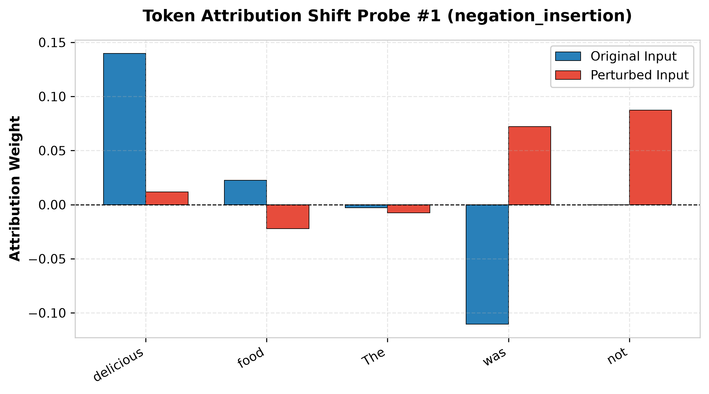
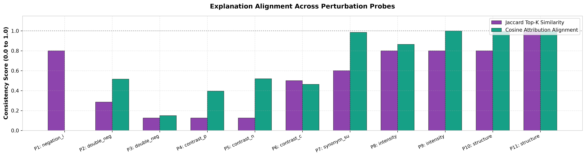

# Explanation Comparison Report

This report details local token feature attributions (LIME & SHAP) compared between original and perturbed inputs.

## Detailed Probe Feature Attributions

### Probe #1: negation_insertion
- **Original Input**: "The food was delicious."
- **Perturbed Input**: "The food was not delicious."
- **Jaccard Attribution Similarity**: 0.8000
- **Cosine Attribution Alignment**: -0.3252

**Top Token Attributions (Perturbed)**:
  - `not`: +0.0875
  - `was`: +0.0723
  - `food`: -0.0221
  - `delicious`: +0.0118
  - `The`: -0.0076

----------------------------------------

### Probe #2: double_negation
- **Original Input**: "The food was delicious."
- **Perturbed Input**: "It is not impossible that the food was delicious."
- **Jaccard Attribution Similarity**: 0.2857
- **Cosine Attribution Alignment**: 0.5155

**Top Token Attributions (Perturbed)**:
  - `impossible`: +0.2255
  - `not`: -0.1927
  - `delicious`: +0.1920
  - `is`: +0.1396
  - `was`: -0.0828

----------------------------------------

### Probe #3: double_negation
- **Original Input**: "The food was delicious."
- **Perturbed Input**: "It is not untrue that the food was delicious."
- **Jaccard Attribution Similarity**: 0.1250
- **Cosine Attribution Alignment**: 0.1495

**Top Token Attributions (Perturbed)**:
  - `untrue`: +0.2995
  - `not`: -0.1525
  - `food`: +0.1057
  - `is`: +0.0646
  - `It`: -0.0540

----------------------------------------

### Probe #4: contrast_positive_append
- **Original Input**: "The food was delicious."
- **Perturbed Input**: "The food was delicious, and every portion was fresh and generous."
- **Jaccard Attribution Similarity**: 0.1250
- **Cosine Attribution Alignment**: 0.3956

**Top Token Attributions (Perturbed)**:
  - `fresh`: +0.0612
  - `was`: -0.0586
  - `delicious,`: +0.0584
  - `generous`: +0.0182
  - `every`: +0.0116

----------------------------------------

### Probe #5: contrast_negative_append
- **Original Input**: "The food was delicious."
- **Perturbed Input**: "The food was delicious, however it was surprisingly displeasing in comparison."
- **Jaccard Attribution Similarity**: 0.1250
- **Cosine Attribution Alignment**: 0.5195

**Top Token Attributions (Perturbed)**:
  - `delicious`: +0.2877
  - `delicious,`: -0.1566
  - `comparison`: +0.1295
  - `displeasing`: +0.1198
  - `however`: +0.1161

----------------------------------------

### Probe #6: contrast_concession_prefix
- **Original Input**: "The food was delicious."
- **Perturbed Input**: "Although the food was delicious, it was surprisingly displeasing in comparison."
- **Jaccard Attribution Similarity**: 0.5000
- **Cosine Attribution Alignment**: 0.4631

**Top Token Attributions (Perturbed)**:
  - `delicious,`: -0.1735
  - `Although`: +0.1328
  - `the`: +0.1157
  - `was`: -0.1129
  - `delicious`: +0.1099

----------------------------------------

### Probe #7: synonym_substitution
- **Original Input**: "The food was delicious."
- **Perturbed Input**: "The meal was delicious."
- **Jaccard Attribution Similarity**: 0.6000
- **Cosine Attribution Alignment**: 0.9846

**Top Token Attributions (Perturbed)**:
  - `delicious`: +0.1402
  - `was`: -0.1105
  - `meal`: +0.0221
  - `The`: -0.0028

----------------------------------------

### Probe #8: intensity
- **Original Input**: "The food was delicious."
- **Perturbed Input**: "The food extremely was delicious."
- **Jaccard Attribution Similarity**: 0.8000
- **Cosine Attribution Alignment**: 0.8648

**Top Token Attributions (Perturbed)**:
  - `delicious`: +0.2118
  - `extremely`: -0.0817
  - `was`: -0.0627
  - `food`: +0.0577
  - `The`: -0.0284

----------------------------------------

### Probe #9: intensity
- **Original Input**: "The food was delicious."
- **Perturbed Input**: "The food somewhat was delicious."
- **Jaccard Attribution Similarity**: 0.8000
- **Cosine Attribution Alignment**: 0.9979

**Top Token Attributions (Perturbed)**:
  - `delicious`: +0.1571
  - `was`: -0.1131
  - `food`: +0.0268
  - `somewhat`: -0.0079
  - `The`: -0.0074

----------------------------------------

### Probe #10: structure
- **Original Input**: "The food was delicious."
- **Perturbed Input**: "In fact, the food was delicious."
- **Jaccard Attribution Similarity**: 0.8000
- **Cosine Attribution Alignment**: 0.9939

**Top Token Attributions (Perturbed)**:
  - `delicious`: +0.1357
  - `was`: -0.1139
  - `food`: +0.0261
  - `fact`: +0.0142
  - `the`: -0.0102

----------------------------------------

### Probe #11: structure
- **Original Input**: "The food was delicious."
- **Perturbed Input**: "The food was delicious..."
- **Jaccard Attribution Similarity**: 1.0000
- **Cosine Attribution Alignment**: 0.9956

**Top Token Attributions (Perturbed)**:
  - `delicious`: +0.1775
  - `was`: -0.1242
  - `food`: +0.0425
  - `The`: -0.0103

----------------------------------------
