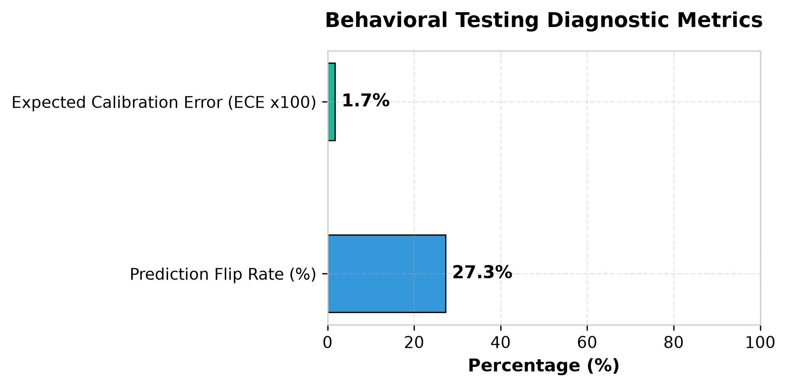
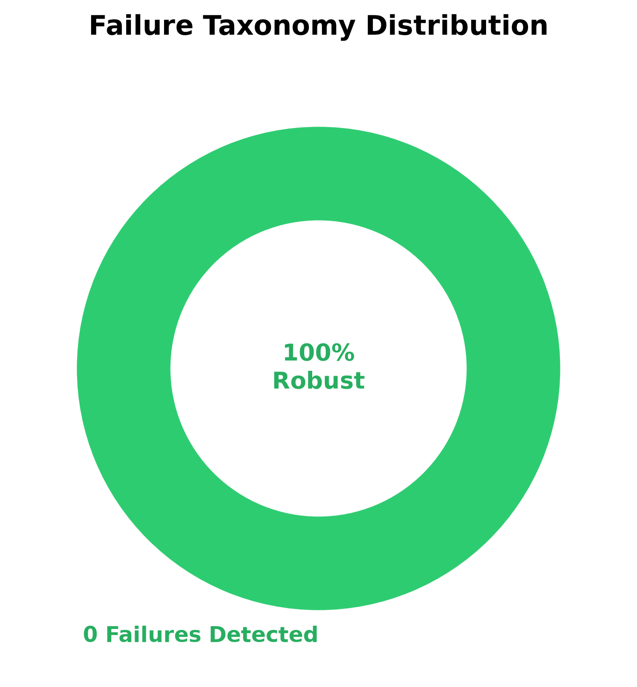

# Model Behavior Audit Report

## Target Model Overview
- **Model Reference**: `distilbert-base-uncased-finetuned-sst-2-english`
- **Input Sentence**: "The food was delicious."
- **Original Prediction**: `POSITIVE` (Confidence: 0.9999)
- **Total Perturbation Probes**: 11
- **Probe Suitability Status**: `SUITABLE`

## Diagnostic Summary Metrics
- **Prediction Flip Rate**: 27.27%
- **Expected Calibration Error (ECE)**: 0.0174 (Chart displays ECE × 100)
- **Total Detected Failures**: 0

### Metric Interpretation Guidelines
1. **Prediction Flip Rate**:
   - **High Flip Rate $\neq$ Automatically Good**, and **Low Flip Rate $\neq$ Automatically Bad**.
   - Flip rate MUST be interpreted in context of perturbation types:
     - **Directional Perturbations** (single negation, negative contrast, concession): Prediction flip is **expected**. A label flip demonstrates that the model appropriately responded to semantic changes.
     - **Invariant Perturbations** (litotes double negation, synonym substitution): Prediction stability is **expected**. A label flip indicates model fragility.
2. **Expected Calibration Error (ECE)**:
   - Lower ECE indicates better confidence calibration.
   - ECE measures the difference between model confidence and observed accuracy across 10 binned confidence levels.
   - ECE alone does not prove that an individual prediction is correct; it assesses calibration across the evaluated probe set.

## Failure Taxonomy Distribution
| Failure Category | Count | Primary Cause |
| :--- | :---: | :--- |
| **Blind** | 0 | Model ignored negation operators |
| **Spurious** | 0 | Model over-relied on entity/domain nouns |
| **Misweighted** | 0 | Model misallocated modifier token weights |

## Actionable Recommendations
1. **Negation Retraining**: Augment training corpus with CheckList negation templates to resolve **Blind** failures.
2. **Adversarial Entity Replacement**: Apply entity swapping during model fine-tuning to prevent **Spurious** correlations.
3. **Contrastive Regularization**: Fine-tune with paired contrast clauses ('X, but Y') to resolve **Misweighted** attributions.
