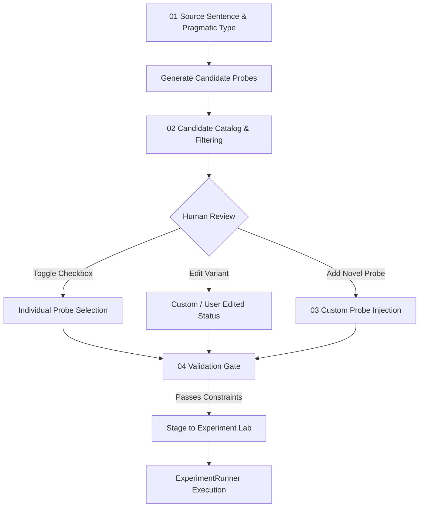

# BlindSpot Probe Selection & Curation Workflow

## 1. Overview

In behavioral machine learning research, automated perturbation algorithms can occasionally generate awkward, grammatically anomalous, or contextually unsuited variants. BlindSpot provides a dedicated **Probe Research Workbench (Probe Lab)** that elevates probe selection to an explicit, interactive research gate before experiment execution.

---

## 2. Workbench Workflow Steps

### Step 01: Source Sentence & Pragmatic Type
The researcher defines the natural language seed sentence and tags its pragmatic/semantic classification:
- **Literal**: Direct, compositional truth-conditional semantics.
- **Proverb**: Idiomatic or culturally crystallized wisdom (e.g., *"A rolling stone gathers no moss"*).
- **Idiom**: Non-compositional figurative phrase (e.g., *"Bite the bullet"*).
- **Figurative**: Metaphorical or poetic framing (e.g., *"Her smile was a ray of sunshine"*).
- **Sarcastic**: Inverted pragmatic polarity (e.g., *"Oh fantastic, another flat tire on Monday morning"*).
- **Ironic**: Situational or structural semantic contradiction.

### Step 02: Candidate Probe Catalog & Selection Controls
Upon generation, candidate stimuli are displayed with comprehensive metadata:
- **Select All / Select None**: Immediate batch controls for quick configuration.
- **Category Filter**: Filter candidates by category (`negation`, `double_negation`, `connective`, `synonym_substitution`, `intensity`, `structure`).
- **Inspection Cards**: Each probe displays:
  - Stable Probe ID (e.g., `8f9b2a1c0d4e5f67`)
  - Semantic Intent pill (`REVERSE_POLARITY`, `PRESERVE_MEANING`, etc.)
  - Expected Transition (`EXPECTS FLIP` vs. `PRESERVES LABEL`)
  - Perturbed variant text
  - Syntactic transformation rule

### Step 03: Custom Probe Injection
Researchers can inject novel, hand-crafted linguistic probes directly into the catalog:
- Enter perturbed variant text.
- Select perturbation category and canonical `SemanticIntent`.
- Specify expected flip behavior (`True` or `False`).
- Document linguistic rationale.
- Injected probes are automatically assigned `status="CUSTOM"`.

### Step 04: Validation & Staging Gate
- **[Validate Selected Probes]**: Invokes `SharedProbeSet.validate()` to ensure non-empty text, absence of duplicate IDs, and complete semantic expectation fields.
- **[Send to Experiment Lab]**: Freezes the active selection into `st.session_state["staged_probe_set"]` and routes to `Experiment Lab`.

---

## 3. Experiment Lab Integration

When a verified probe set is staged:
1. `Experiment Lab` displays a prominent green badge: `✓ VERIFIED PROBE CATALOG ACTIVE (N probes)`.
2. The dynamic generation controls are bypassed, and the researcher can inspect the exact stimuli staged for execution.
3. The **Exact Run Plan** computes:
   $$\text{Total Inferences} = \text{Models} \times (\text{Seed Sentences} + \text{Staged Probes})$$
4. The exact `staged_probe_set` is passed into `ExperimentConfig(selected_probe_set=staged_set)` and executed without re-generation.
