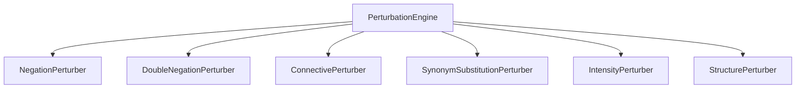

# BlindSpot Controlled Linguistic Perturbation Design

## 1. Perturbation Engine Hierarchy

BlindSpot provides 6 perturbation engines targeting distinct linguistic phenomena:

---

## 2. Engine Specifications

### 2.1 NegationPerturber (`blindspot.perturbations.negation`)
- **Phenomenon**: Polarity reversal via syntactic negation operator injection or removal.
- **Transformations**: Auxiliary verb negation (`was` $\rightarrow$ `was not`), quantifier inversion (`all` $\rightarrow$ `no`), contracted forms (`isn't`).
- **Semantic Expectation**: `expected_flip = True`, `expected_semantic_effect = "invert"`, `semantic_intent = ADD_NEGATION`.

### 2.2 DoubleNegationPerturber (`blindspot.perturbations.negation`)
- **Phenomenon**: Double negation syntactically modifies structure while maintaining underlying semantic polarity.
- **Transformations**: Litotes (`not uncommon`, `hardly impossible`, `by no means terrible`).
- **Semantic Expectation**: `expected_flip = False`, `expected_semantic_effect = "preserve"`, `semantic_intent = PRESERVE_MEANING`.

### 2.3 ConnectivePerturber (`blindspot.perturbations.connectives`)
- **Phenomenon**: Discourse connectives shifting prominence or establishing contrast.
- **Transformations**:
  - Adversative: `[Clause A], but [Clause B]` (`expected_flip = True`).
  - Concessive: `Although [Clause A], [Clause B]` (`expected_flip = True`, main clause dominates).
  - Correlative: `Not only [Clause A], but also [Clause B]` (`expected_flip = False`, strengthens).
  - Causal: `Because [Clause A], [Clause B]` (`expected_flip = False`).

### 2.4 SynonymSubstitutionPerturber (`blindspot.perturbations.substitution`)
- **Phenomenon**: Lexical replacement using semantic synonyms from WordNet / curated sets.
- **Transformations**: Replacing key sentiment adjectives with lexical equivalents (`great` $\rightarrow$ `superb`).
- **Semantic Expectation**: `expected_flip = False`, `expected_semantic_effect = "preserve"`, `semantic_intent = PRESERVE_MEANING`.

### 2.5 IntensityPerturber (`blindspot.perturbations.intensity`)
- **Phenomenon**: Modulating predicate strength via intensifiers or downtoners without polarity inversion.
- **Transformations**:
  - Intensifiers: `extremely`, `incredibly`, `truly`, `remarkably` (`expected_flip = False`, `expected_semantic_effect = "strengthen"`, `semantic_intent = STRENGTHEN_POLARITY`).
  - Downtoners: `somewhat`, `slightly`, `moderately`, `marginally` (`expected_flip = False`, `expected_semantic_effect = "weaken"`, `semantic_intent = WEAKEN_POLARITY`).

### 2.6 StructurePerturber (`blindspot.perturbations.structure`)
- **Phenomenon**: Syntactic reorganization preserving truth-conditions.
- **Transformations**:
  - Comma-separated clause inversion (`Because X, Y` $\rightarrow$ `Y, because X`).
  - Discourse framing (`In fact, ...`, `Undeniably, ...`).
  - Punctuation drift (exclamation vs. period vs. trailing ellipsis).
- **Semantic Expectation**: `expected_flip = False`, `expected_semantic_effect = "preserve"`, `semantic_intent = PRESERVE_MEANING`.
